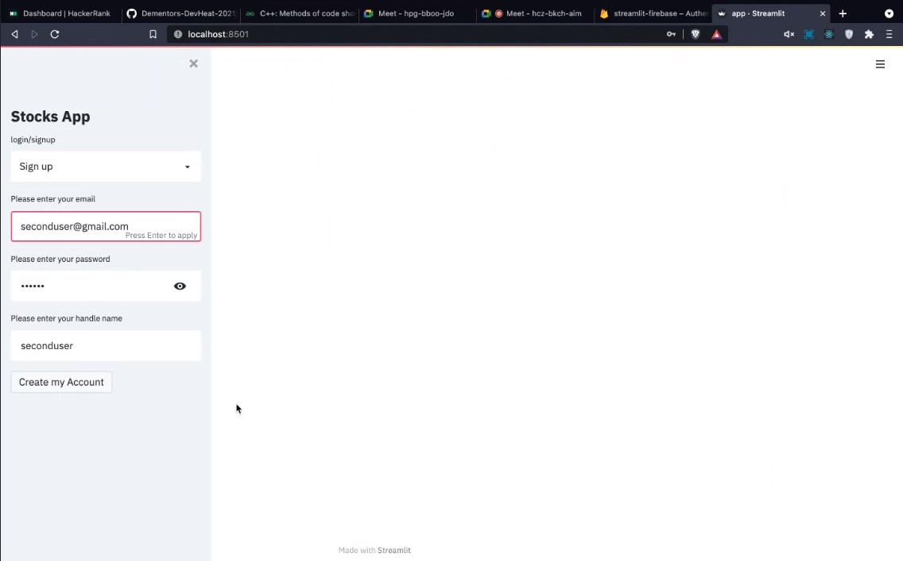
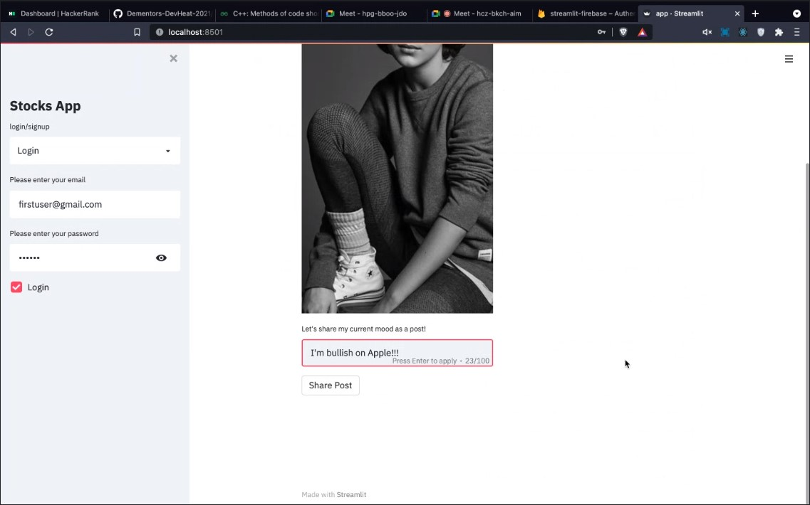
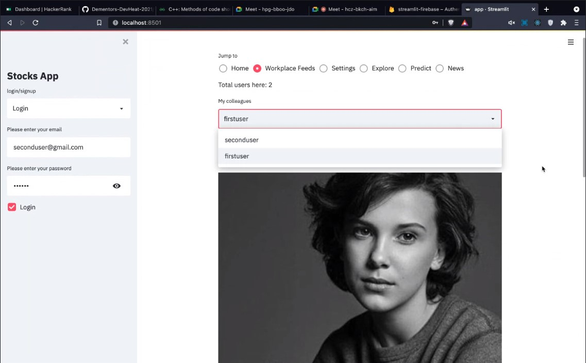
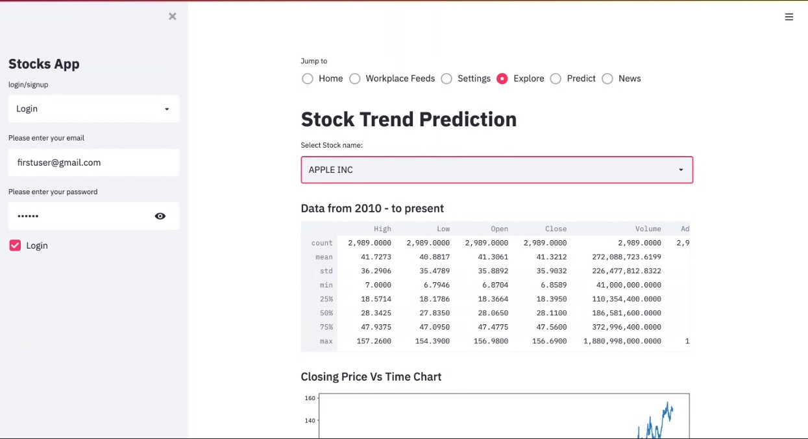
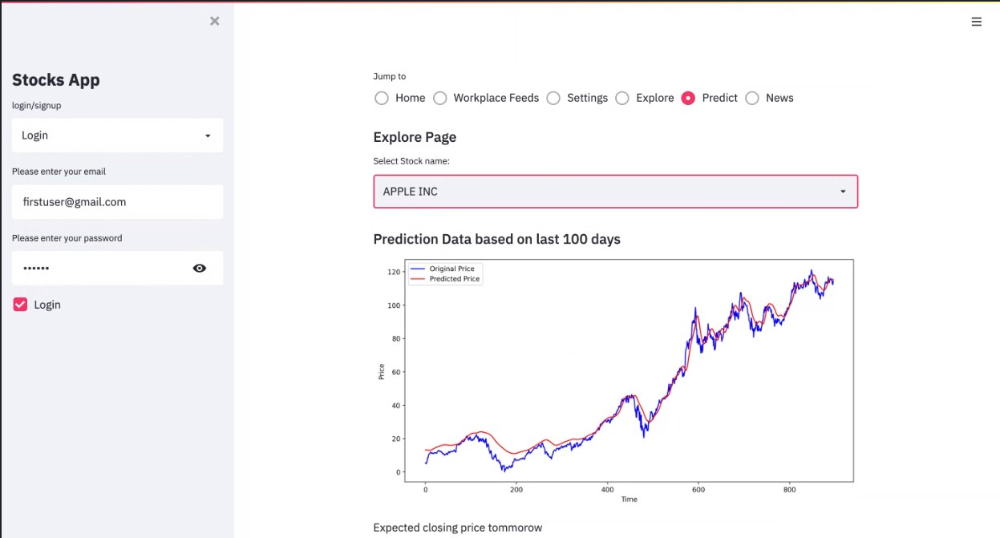
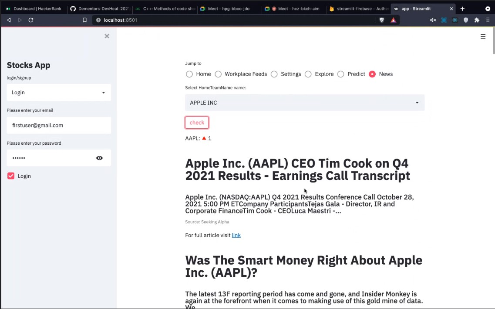

#Stock-Market-Prediction-Web-App-using-Machine-Learning
Stock Market Prediction Web App based on Machine Learning  (API keys included in code). The front end of the Web App is based on Streamlit. The App predicts stock price for the selected stock based on the previous closing stock price data. Predictions are made using LSTM Algorithm. The Web App include features of the prediction prices of the next day, latest news, Graphical analysis and Workplace feeds. 
##Technologies Used
 - Streamlit
 - Keras
 - Python
 - numpy
 - firebase
 - pandas
 - matplotlib

##NAVIGATION

Home Page - Here user can see his own profile and the posts made by the user as well as share any posts with other users.

Workplace Feed - Here user can navigate through the profiles of other users registered on the app and see their posts.

Explore Page - Here user can find the charts for price and moving averages for any desired stock.

Predict Page - here user can compare the predicted stock price model with original stock price and get the predicted stock price for the next day.

News Page - Here user can select any desired stock name and get the latest news regarding the respective stock through various sources automatically.

##RUN ON YOUR LOCAL MACHINE
 - Clone the repo to your local machine
 - Install all the required libraries using `pip install <library name>`
 - Run command `Streamlit run app.py`
